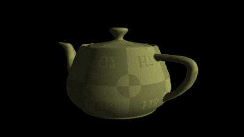

# Shading Playground

Contains examples of different types of shading modes and practices. Includes different models and collection of tweakable settings.

Each shading type is done in a separate project with its own shader files to allow easy reuse.

Common files are shared like model loading, sphere generation and texture loading in a header only function library.

## Shaders

- Toon Shader
- Phong Shading
- Flat-Phong Shading
- Gouraud Shading
- Outline shader
- PSX shader

  

## Features
- UI for tweaking shader parameters.
- Comes with different Meshes to show off shading.
- Saperate projects for ease in code mobility.
- Shared header only function library.

### Outline
Comes with toggle outline option and outline thickness, is used with toon shader but you can use the outline shader pretty much anywhere as it comes in its own shader files, It is made using inverted hull technique so make sure all your meshes have CCW winding order.

  

### Flat
It is a variation of Phong shading, all it does is flat out the normals.

  

### PSX
PS1 style shader with low precision, giving the iconic wobbly look of its time. Comes with the option to define the lower grid resolution.

  

---

## Built With

- **Language**: C++, GLSL
- **Build System**: [CMake](https://cmake.org/)
- **Third Party**: Lightweight Vulkan, ImGUI, ASSIMP, STB
- **Platform**: Windows

---

## Getting Started
- Clone the repository along with its submodules: `git clone --recursive "https://github.com/RoastedKaju/LVK-Shading.git"`
- run command `cmake -B build` in the root folder.
- Open the generated solution file called `Shading`.
- Build and any of the following projects: `Phong`, `Toon`, `Gouraud`