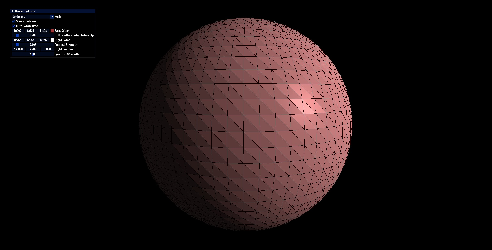
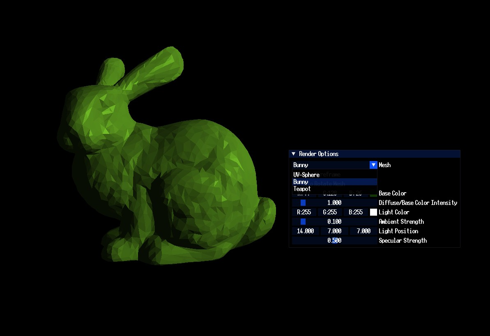

# Shading Playground

Contains examples of different types of shading modes and practices. Includes different models and collection of tweakable settings.

Each shading type is done in a separate project with its own shader files to allow easy reuse.

Common files are shared like model loading, sphere generation and texture loading in a header only function library.

## Shaders

- Toon Shader
- Phong Shading
- Flat-Phong Shading
- Gouraud Shading

  

## Features
- UI for tweaking shader parameters.
- Comes with different Meshes to show off shading.
- Saperate projects for ease in code mobility.
- Shared header only function library.

  

  

---

## Built With

- **Language**: C++, GLSL
- **Build System**: [CMake](https://cmake.org/)
- **Third Party**: Lightweight Vulkan, ImGUI, ASSIMP, STB
- **Platform**: Windows

---

## Getting Started
- Clone the repository along with its submodules.
- run command `cmake -B build` in the root folder.
- Open the generated solution file called `Shading`.
- Build and any of the following projects: `Phong`, `Toon`, `Gouraud`